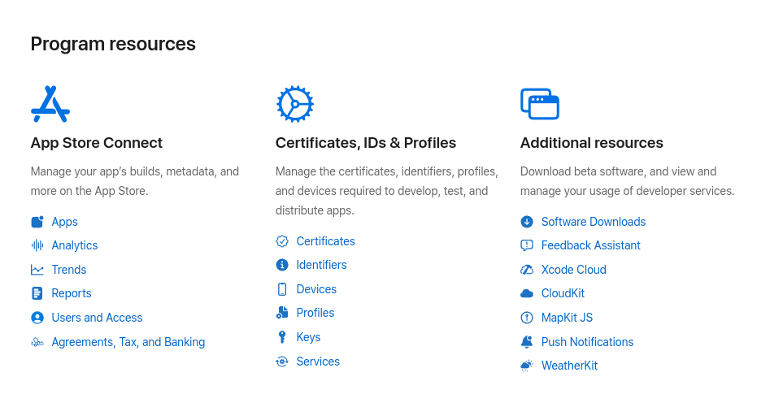
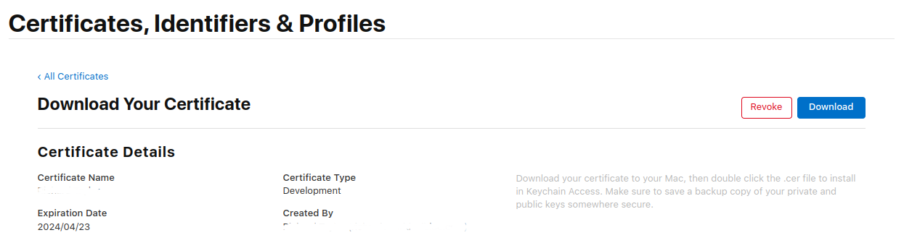

# Echo Chamber Mobile App Example

A super simple echo chamber mobile app example written in in [`Flutter`](https://flutter.dev/) to show how [Approov](https://approov.io/product) can be integrated when using the [phoenix_wings](https://pub.dev/packages/phoenix_wings) Dart package to talk with an [Elixir Phoenix Channels](https://hexdocs.pm/phoenix/channels.html) backend. This quickstart provides a step-by-step example of integrating Approov into an app using a simple `Echo Chamber` app example that performs an echo of user input based on a request to an API backend that can be protected with Approov.

## WHAT YOU WILL NEED
* Access to a trial or paid Approov account
* The `approov` command line tool [installed](https://approov.io/docs/latest/approov-installation/) with access to your account
* [Android Studio](https://developer.android.com/studio) installed (version Bumblebee 2021.1 is used in this guide) if you will build the Android app
* [Xcode](https://developer.apple.com/xcode/) installed (version 13.3 is used in this guide) to build iOS version of application
* [Cocoapods](https://cocoapods.org) installed to support iOS building (1.11.3 used in this guide)
* [Flutter](https://flutter.dev) stable version 3.0.1 is used in this guide. Note that integration is not possible with stable versions earlier than Flutter 3.
* The contents of this repo

## Try The Echo Chamber App Without Approov

First, clone this repo:

> git clone https://github.com/approov/quickstart-flutter-elixir-phoenix-channels.git

Next, open a shell on the directory `src/echo-chamber-app`. You can then use `flutter run` to build and run the app on a connected physical device.

> NOTE: The mobile app will run against this live backend `https://unprotected.phoenix-channels.demo.approov.io`, and the code for it is in the [approov/quickstart-elixir-phoenix-channels-token-check](https://github.com/approov/quickstart-elixir-phoenix-channels-token-check/tree/main/src/unprotected-server/echo) Github repo at `src/unprotected-server/echo`.

### iOS Potential Issues

If the iOS build fails with an error related to `Pods-Runner` then navigate inside `ios` folder using `cd ios` and run `pod install`.

If the iOS build fails with a signing error, open the Xcode project located in `ios/Runner.xcworkspace`:

```
$ open ios/Runner.xcworkspace
```

and select your code signing team in the _Signing & Capabilities_ section of the project.

Also ensure you modify the app's `Bundle Identifier` so it contains a unique string (you can simply append your company name). This is to avoid Apple rejecting a duplicate `Bundle Identifier` when code signing is performed. Then return to the shell and repeat the failed build step.

Please also verify the minimum iOS supported version is set to `iOS 10` if there is a supported version mismatch error.

### Android Potential Issues
If the Android build fails with `Manifest merger failed : Attribute application@label value=([...]) from AndroidManifest.xml:11:9-46 is also present at [approov-sdk.aar] AndroidManifest.xml:12:9-41 value=(@string/app_name)`, then open `android/app/src/main/AndroidManifest.xml` in an editor and make the following changes.

- Add the schema as an attribute in the `manifest` tag:

```
    <manifest ...
        xmlns:tools="http://schemas.android.com/tools"
        ... >
```
- Add the `android:label` and `tools` attributes to the `application` tag:
```
    <application ...
        android:label="@string/app_name"
        tools:replace="label"
        ... >
```

## ADDING APPROOV SUPPORT

Approov protection is provided through the `approov_service_flutter_httpclient` plugin for both, Android and iOS mobile platforms. This plugin handles all Approov related functionality, including the fetching of Approov tokens and adding these to the `Approov-Token` header for each API request. It also provides you with [dynamic certificate pinning](https://approov.io/docs/latest/approov-usage-documentation/#approov-dynamic-pinning) out of the box, without the need for you to code anything.

To enable Approov you only need to comment or comment out some lines of code that are after `// COMMENT LINE BELOW IF USING APPROOV` or `// UNCOMMENT LINES BELOW IF USING APPROOV`.

Look at the `quickstart-flutter-elixir-phoenix-channels/src/echo-chamber-app/pubspec.yaml` and find the lines that need to be changed for the Approov integration. The `Phoenix Channels` support is located in the [approov-flutter-packages](https://github.com/approov/approov-flutter-packages.git) repository and is installed by the changes. This also includes the `approov-service-flutter-httpclient` package.

Edit the file `quickstart-flutter-elixir-phoenix-channels/src/echo-chamber-app/lib/http_service.dart` by finding the lines that need to be changed when using Approov. Uncomment the appropriate lines and add the config line. The `<enter-your-config-string-here>` is a custom string that configures your Approov account access. This will have been provided in your Approov onboarding email.


### ADDING THE PROTECTED API DOMAIN

The app will run against [this backend](https://github.com/approov/quickstart-elixir-phoenix-channels-token-check/tree/main/src/approov-protected-server/token-check/echo), that is live at `token.phoenix-channels.demo.approov.io`, thus we also need to let the Approov cloud service know the API domain for it:

```Bash
approov api -add token.phoenix-channels.demo.approov.io
```
> **NOTE:** This command only needs to be executed the first time you register an APK/IPA with Approov.

The Approov cloud service will not issue Approov tokens for your mobile app if you forget this step, even if the mobile app binary is registered and no tampering is detected with the binary on the environment is running on.

If you want to run the mobile app against a backend you have control off, then you need to follow the [deployment guide](https://github.com/approov/quickstart-elixir-phoenix-channels-token-check/blob/main/DEPLOYMENT.md) for the backend of this Echo Chamber mobile app.

### ADD YOUR SIGNING CERTIFICATE TO APPROOV
You should add the signing certificate used to sign apps so that Approov can recognize your app as being official.

#### Android
Add the local certificate used to sign apps in Android Studio. The following assumes it is in PKCS12 format:

```
approov appsigncert -add ~/.android/debug.keystore -storePassword android -autoReg
```

See [Android App Signing Certificates](https://approov.io/docs/latest/approov-usage-documentation/#android-app-signing-certificates) if your keystore format is not recognized or if you have any issues adding the certificate.

#### iOS
These are available in your Apple development account portal. Go to the initial screen showing program resources:



Click on `Certificates` and you will be presented with the full list of development and distribution certificates for the account. Click on the certificate being used to sign applications from your particular Xcode installation and you will be presented with the following dialog:



Now click on the `Download` button and a file with a `.cer` extension is downloaded, e.g. `development.cer`. Add it to Approov with:

```
approov appsigncert -add development.cer -autoReg
```

If it is not possible to download the correct certificate from the portal then it is also possible to [add app signing certificates from the app](https://approov.io/docs/latest/approov-usage-documentation/#adding-apple-app-signing-certificates-from-app).

> **IMPORTANT:** Apps built to run on the iOS simulator are not code signed and thus auto-registration does not work for them. In this case you can consider [forcing a device ID to pass](https://approov.io/docs/latest/approov-usage-documentation/#forcing-a-device-id-to-pass) to get a valid attestation.

### RUN THE APP

You can now use the Echo Chamber app and play with it, but you need to restart it in order for the mobile to get a valid Approov token, because in the first launch it was not yet registered with the Approov cloud service.

### WHAT IF THE ECHO CHAMBER APP DOESN'T WORK

If you are unable to use the app then this may be because the device you are using has some characteristics that cause rejection for the currently set [Security Policy](https://approov.io/docs/latest/approov-usage-documentation/#security-policies) on your Approov account:

* Ensure that the version of the app you are running is signed with the correct certificate.
* Look at the Flutter logging for the device. Information about any Approov token fetched or an error is output at the debug level and is prefixed `ApproovService: updateRequest`. You can easily check the validity of the [loggable token](https://approov.io/docs/latest/approov-usage-documentation/#loggable-tokens) provided find out any reason for a failure.
* Use `approov metrics` to see [Live Metrics](https://approov.io/docs/latest/approov-usage-documentation/#metrics-graphs) of the cause of failure.
* You can use a debugger or emulator/simulator and get valid Approov tokens on a specific device by ensuring you are [forcing a device ID to pass](https://approov.io/docs/latest/approov-usage-documentation/#forcing-a-device-id-to-pass). As a shortcut, you can use the `latest` as discussed so that the `device ID` doesn't need to be extracted from the logs or an Approov token.
* Also, you can use a debugger or Android emulator and get valid Approov tokens on any device if you [mark the signing certificate as being for development](https://approov.io/docs/latest/approov-usage-documentation/#development-app-signing-certificates).
* Approov token data is logged to the console using a secure mechanism - that is, a _loggable_ version of the token is logged, rather than the _actual_ token for debug purposes. This is covered [here](https://www.approov.io/docs/latest/approov-usage-documentation/#loggable-tokens).
